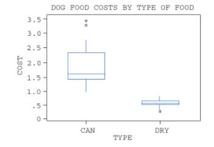

<!-- 
Homework 1: Due Sep. 2 (Thursday), 2021

- Read Ch.3
-->

# Andrew Moore, 8/26/2021

## MATH-471, Homework 1

This document was prepared using the `knitr` and `rmarkdown` packages, with `r R.version$version.string`.

## 3.7

> The survival times (in months) for two treatments for patients with severe chronic left ventricular heart failure are given in the following tables.

```{r}
standard <- c(
  4, 15, 24, 10, 1, 27, 3, 14, 2, 16, 32, 7, 13, 36, 29, 6, 12, 18, 14, 15, 1,
  6, 13, 21, 20, 8, 3, 2
)

new_therapy <- c(
  5, 20, 29, 15, 7, 32, 36, 17, 15, 19, 35, 10, 16, 39, 27, 14, 10, 16, 12, 13, 16,
  9, 18, 33, 30, 29, 31, 27
)
```

a. Construct separate relative frequency histograms for the survival times of both the therapies.

```{r}
par(mfrow = c(1, 2))
hist(standard, main = "Standard Treatment", xlab = "Survival Time")
hist(new_therapy, main = "New Treatment", xlab = "Survival Time")
```

b. Compare the two histograms. Does the new therapy appear to generate a longer survival time? Explain your answer.

The new therapy seems to be somewhat more effective at increasing the survival times of patients. A higher relative frequency of patients are reaching survival times of 25 months or more. Both groups of patients have the same standard deviation for survival time, but the *new therapy* group has a higher average (and median) survival time.

```{r}
data.frame(
  Measure = c("Sample Mean", "Sample Median", "Sample Standard Deviation"),
  Standard_Therapy = round(c(mean(standard), median(standard), sd(standard)), 2),
  New_Therapy = round(c(mean(new_therapy), median(new_therapy), sd(new_therapy)), 2)
)
```

\newpage

## 3.26

> Pushing economy and wheelchair-propulsion technique were examined for eight wheelchair racers on a motorized treadmill in a paper by Goosey and Campbell [Adapted Physical Activity Quarterly (1998) 15:36–50]. The eight racers had the following years of racing experience:
>
> Racing experience (years): 6, 3, 10, 4, 4, 2, 4, 7

a. Verify that the mean years of experience is 5 years. Does this value appear to adequately represent the center of the data set?

$$
\bar{y} = \frac{(2 + 3 + 4 + 4 + 4 + 6 + 7 + 10)}{8} = \frac{40}{8} = 5
$$
I would say that the center is probably closer to 4.5, and that the presence of the two races with 2 and 10 years of experience are distorting what we see from the sample mean.

b. Verify that $\Sigma_i(y_i - \bar{y})^2 = \Sigma_i(y_i - 5)^2 = 46$.

We know from part a. that the sample mean, $\bar{y}$ is 5. Representing $y$ as a column vector, we can calculate the sum:

$$
y = \begin{bmatrix} 6 \\ 3 \\ 10 \\ 4 \\ 4 \\ 2 \\ 4 \\ 7 \end{bmatrix}
$$
$$
\Sigma_i(y_i - 5)^2 = \Sigma
\begin{bmatrix}
  (6 - 5)^2 \\
  (3 - 5)^2 \\
  (10 - 5)^2 \\
  (4 - 5)^2 \\
  (4 - 5)^2 \\
  (2 - 5)^2 \\
  (4 - 5)^2 \\
  (7 - 5)^2 \\
\end{bmatrix} = \Sigma
\begin{bmatrix}
  1 \\ 4 \\ 25 \\ 1 \\ 1 \\ 9 \\ 1 \\ 4
\end{bmatrix} = 46
$$

This value is the *sum of squared deviations* from the mean $\bar{y}$.

c. Calculate the sample variance and standard deviation for the experience data. How would you interpret the value of the standard deviation relative to the sample mean?

The sample variance, $s^2_y$, is the sum of squared deviations from the mean, divided by the sample size (minus 1). There are 8 racers, so our sample size is $n = 8$.

$$
s^2_y = \frac{1}{n - 1} \Sigma_i (y_i - \bar{y})^2 = \frac{46}{7} \approx 6.57 
$$

The sample standard deviation, $s_y$, is the square-root of the variance.

$$
s_y = \sqrt{\frac{1}{n - 1} \Sigma_i (y_i - \bar{y})^2} = \sqrt{\frac{46}{7}} \approx 2.56
$$

Having computed both the mean and standard deviation, I would say that the average racer in our sample has 5 years of experience, plus or minus about 5 years.

\newpage

## 3.30

> To assist in estimating the amount of lumber in a tract of timber, an owner decided to count the number of trees with diameters exceeding 12 inches in randomly selected 50 3 50-foot squares. Seventy 50 3 50 squares were randomly selected from the tract and the number of trees (with diameters in excess of 12 inches) was counted for each. The data are as follows.

```{r}
timber <- "7 8 6 4 9 11 9 9 9 10 9 8 11 5 8 5 8 8 7 8 3 5 8 7 10 7 8 9 8 11 10 8 9 8 9 9 7 8 13 8 9 6 7 9 9 7 9 5 6 5 6 9 8 8 4 4 7 7 8 9 10 2 7 10 8 10 6 7 7 8"

timber <- timber |>
  strsplit(" ")  |>
  unlist()       |>
  as.numeric()

print(timber)
```

a. Construct a relative frequency histogram to describe these data.

```{r}
hist(timber, main = "Number of Trees with Trunk Diameter > 12in, per 50 x 50ft plot", xlab = "# Trees")
```

b. Calculate the sample mean $\bar{y}$ as an estimate of $\mu$, the mean number of timber trees with diameter exceeding 12 inches for all 50 3 50 squares in the tract.

```{r}
# sample mean
(ybar <- mean(timber))
```

c. Calculate $s$ for the data. Construct the intervals $(\bar{y} + s)$, $(\bar{y} + 2s)$, and $(\bar{y} + 3s)$. Count the percentages of squares falling in each of the three intervals, and compare these percentages with the corresponding percentages given by the Empirical Rule.

```{r}
# sample standard deviation
(s <- sd(timber))

# calculate the 3 intervals
(ybar_plus_s  <- ybar + 1 * c(-s, s))
(ybar_plus_2s <- ybar + 2 * c(-s, s))
(ybar_plus_3s <- ybar + 3 * c(-s, s))

library(dplyr, include.only = "between")  # bring in the between() function

# empirical rule predicts 68.27%
sum(between(timber, ybar_plus_s[1], ybar_plus_s[2])) / length(timber)

# empirical rule predicts 95.45%
sum(between(timber, ybar_plus_2s[1], ybar_plus_2s[2])) / length(timber)

# empirical rule predicts 99.73%
sum(between(timber, ybar_plus_3s[1], ybar_plus_3s[2])) / length(timber)
```

\newpage

## 3.35

> Consumer Reports in its May 1998 issue provides cost per daily feeding for 28 brands of dry dog food and 23 brands of canned dog food. Using the Minitab computer program, the following side-by-side boxplot for these data was created.



a. From these graphs, determine the median, lower quartile, and upper quartile for the daily costs of both dry and canned dog food.

b. Comment on the similarities and differences in the distributions of daily costs for the two types of dog food.

\newpage

## 3.44

> The College of Dentistry at the University of Florida has made a commitment to develop its entire curriculum around the use of self-paced instructional materials such as videotapes, slide tapes, and syllabi. It is hoped that each student will proceed at a pace commensurate with his or her ability and that the instructional staff will have more free time for personal consultation in student–faculty interaction. One such instructional module was developed and tested on the first 50 students proceeding through the curriculum. The following measurements represent the number of hours it took these students to complete the required modular material. 

```{r}
times <- "16 8 33 21 34 17 12 14 27 6 33 25 16 7 15 18 25 29 19 27 5 12 29 22 14 25 21 17 9 4 12 15 13 11 6 9 26 5 16 5 9 11 5 4 5 23 21 10 17 15"

times <- times   |>
  strsplit(" ")  |>
  unlist()       |>
  as.numeric()   |>
  sort()

print(times)
```

a. Calculate the mode, the median, and the mean for these recorded completion times.

```{r}
# finding the mode
stem(times)
```

Based on the stem & leaf plot, it appears that **5** is the modal value.

```{r}
median(times)

mean(times)
```

b. Guess the value of s.

Using a histogram to get a visual sense of the data...

```{r}
hist(times, xlab = "Completion Times", main = "")
```

I would guess that the value of $s$ is around 7?

c. Compute $s$ by using the shortcut formula and compare your answer to that of part (b).

The approximate formula for $s$ is:

$$
s = \frac{range}{4} = \frac{30}{4} = 7.5
$$

Fairly close, but I was a little below the approximation.

```{r, echo = FALSE, eval = FALSE}
# what's the *actual* value of s?
sd(times)
```

d. Would you expect the Empirical Rule to describe adequately the variability of these data? Explain.

Without having done the calculations, **yes,** I would assume the Empirical Rule would adequately describe the variability of these data. The data are not bimodal, and while there is a minor positive skew, they're otherwise symmetrical. The Empirical Rule is robust to minor deviations from symmetry, as long as the distribution is roughly mound shaped.

\newpage

## 3.58

> The most widely reported index of the performance of the New York Stock Exchange (NYSE) is the Dow Jones Industrial Average (DJIA). This index is computed from the stock prices of 30 companies. When the DJIA was invented in 1896, the index was the average price of 12 stocks. The index was modified over the years as new companies were added and dropped from the index and was also altered to reflect when a company splits its stock. The closing New York Stock Exchange (NYSE) prices for the 30 components (as of June 19, 2014) of the DJIA are given in the following table.

```{r}
# retrieved from the textbook
nyse <- read.csv("../data/3.58.txt")

print(nyse)
```

a. Compute the average price of the 30 stock prices in the DJIA.

```{r}
mean(nyse$price)
```

b. The DJIA is no longer an average; the name includes the word “average” only for historical reasons. The index is computed by summing the stock prices and dividing by a constant, which is changed when stocks are added or removed from the index and when stocks split.

$$
DJIA = \frac{\Sigma^{30}_{j = 1}y_i}{C}
$$

where $y_i$ is the closing price for stock $i$ and $C = 0.155625$. Using the stock prices given, compute the DJIA for June 19, 2014.

```{r}
const <- 0.155625

sum(nyse$price) / const
```

c. The DJIA is a summary of data. Does the DJIA provide information about a population using sampled data? If so, to what population? Is the sample a random sample?

